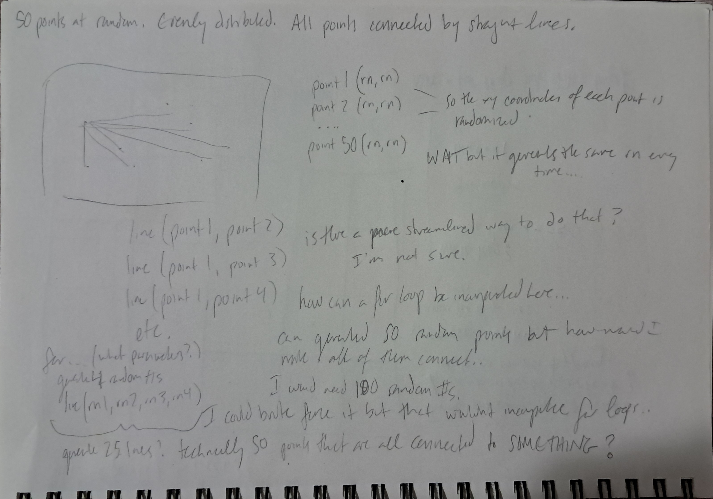
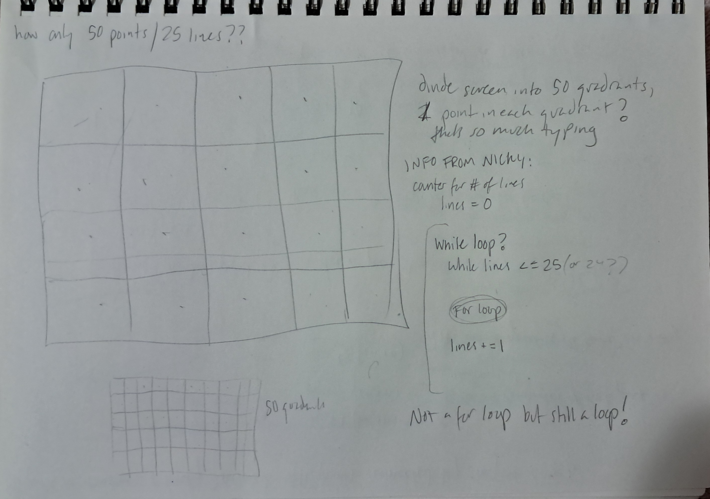

# p5.js multi sketch template

## HW04A

I started off by making a normal grid of white squares against a black background, based on the code that we started off with in class. I randomized the sizes of each square and I liked the way `noFill();` made the thin white strokes look against the black background.

I wanted to play with `mouseClicked()` but instead of generating random shapes upon loading the page and having the page reset with every mouse click, I wanted each click to randomly generate either stars, circles, or squares exclusively. 


I couldn't think of a way to do this with the `for()` loops still existing in `setup()`, so instead basically everything is happening within `mouseClicked()`. Instead of having one `for()` loop randomly generating all three shapes together, like we had in class, the best way I could think of to have each click generate just one group of shapes was to separate the code into three `for()` loops, one for each shape.

By having each click generate a random number, and then creating an `if()` argument where each shape's `for()` loop has an equal chance of being generated, I could make it so both the shape that's being generated is random each time, and the shapes themselves are random in size, color, and location. 

After I set up the three `for()` loops and made sure those worked, I made it so the size of shapes was randomized upon each generation. This worked, but once I tried to set up random colors I ran into some issues. 

I wanted each shape to have its own color zone (yellow for stars, blue for circles, red for squares), and then each shape would be a random shade within those color zones. I managed to get the stars to generate yellow every time, but when I tried to apply the same code to squares and circles, it wouldn't work and still only the stars were colored. After a lot of frustration and moving code around I reached out to a friend who pointed out to me that I had forgotten hash signs on the hex colors for squares and circles! Which was a useful lesson on getting fresh eyes on code issues. 

I then randomized the shapes' locations onscreen, changed the `let rn = random()` range from `(0, 8)` to `(0, 9)`, and changed the `if()` ranges to make a more equal shape distribution.

Then I realized the screen was getting quite crowded after a few clicks so I added another `if()` argument so that the screen would randomly reset every so often, which meant I had to change the `let rn = random()` range again from `(0, 9)` to `(0, 10)`, where anything between 9 and 10 meant the screen would reset.
 
## HW04B

I tried to recreate Wall Drawing #118, "On a wall surface, any continuous stretch of wall, using a hard pencil, place fifty points at random. The points should be evenly distributed over the area of the wall. All of the points should be connected by straight lines."

I went through a lot of different ideas for how to do this because I felt sure that this was something that could be done very simply and shortly but the most obvious ways to do it were incredibly code-heavy.



I first thought I could use `let rn = random(0, width)` and have 50 points, `let point1 = (rn, rn)` through `let point50 = (rn, rn)` and then create 25 lines like `line(point1, point2)`, `line(point2, point3)`, etc. But I quickly realized that in order for all the points to be different, that would mean having 100 different random numbers generated for the points, and that none of this would involve a `for()` loop. 

I eventually managed to generate multiple lines all with random start and end points with

```
for (x = 0; x < width; x += 100) {
  for (y = 0; y < height; y += 100) {
    let r1 = random(0, width);
    let r2 = random(0, height);
    let r3 = random(0, width);
    let r3 = random(0, height);

    line(r1, r2, r3, r4);
  }
}
```
However, this didn't limit the amount of lines to 25 (aka the amount of points to 50). I briefly toyed with the idea of splitting the screen up into 50 quadrants and generating one point randomly within each quadrant to make 25 lines, but realized that would take about just as much brute-forcing as my original ideas. 



I reached out to the same friend, and they said that in python they would use a `while` loop to solve this, and that p5.js might have something similar, which it does! The p5.js reference page for `while` loops was fairly simple to figure out, so I made one that counted the number of lines from 0 to 24, while keeping my randomized line generation within it, and this worked to create 25 random lines (aka 50 random connected points). I know the assignment said to use `for()` loops, but this was much simpler and more streamlined.

I also added another `mouseClicked()` function to reset the screen with every click.
